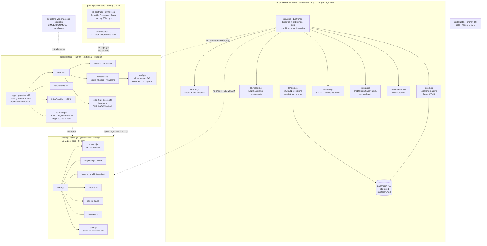

# ARCHITECTURE — Decentralflix
Owner: ARC (Architect) · Phase 2 · 2026-09-29 · REFACTOR_MODE=propose (design only — no structural changes executed)

> This is the devteam's working architecture document. It supersedes nothing at
> the repo root; root docs (`ARCHITECTURE.md`, `ARCHITECTURE_REVIEW_v2.md`,
> `STORAGE_STREAMING_ARCHITECTURE_DECISION.md`) are historical/strategy context —
> several are stale (DOC-004). The map this is built on is `devteam/MAP.md`;
> findings live in `devteam/findings/arc.md` (ARC-001…ARC-010); explanatory
> notes in `devteam/notes/architecture.md`.

---

## 1. As-is architecture

Three runtime systems and one library module share the repo but almost no code
paths. The honest one-sentence version: **a working zero-dependency Node
backend with its own storefront (:8080), a disconnected Next.js marketing/dApp
frontend (:3000), undeployed Solidity contracts, and a tested-but-unwired
encrypted-storage module.**



### Real data flows (verified by reading)

| # | Flow | Path | State |
|---|---|---|---|
| F1 | Filmmaker upload → listing | `POST /api/films/import` (multipart, ≤1 GiB, rights attestation) → `importFilm` (`server.js:432`) → `data/films.json` + `data/masters/<id>.mp4` → `GET /api/films` | **Live** on :8080 |
| F2 | Test purchase → entitlement → stream | `POST /api/purchases/test` → `grantEntitlement` (`server.js:387`) signs receipt + inserts entitlement → `GET /api/films/:id/stream` entitlement check (`server.js:1128`) → `CDN.streamFile` 200/206/416 | **Live** on :8080 (test_mode, no money) |
| F3 | Pass subscribe → redeem | `POST /api/passes/test` → `createPass` + `issueCredits` → `POST /api/passes/:id/redeem` → `redeemCredit` (403 on email mismatch) → `grantEntitlement` | **Live** on :8080 (test-mode only) |
| F4 | Vimeo import → claim → approve | `POST /api/buyers/import` (contacts only, never entitlements) → `POST /api/claims` → `POST /api/claims/:id/approve` (filmmaker-only) → `grantEntitlement` | **Live** on :8080 |
| F5 | Subscription / PPV / tickets | Frontend wrappers → `SubscriptionManager` / `PayPerView` / `TicketNFT` | **Dead** — all addresses `0x0`, UNDEPLOYED guard throws |
| F6 | Encrypted fragment store/retrieve | `storeFilm`/`retrieveFilm` (`packages/storage/src/store.js`) | **Dead** — zero importers outside its tests |
| F7 | NFT-gated signed-URL delivery | `cloudflare-worker/access-control.js` | **Dead** — simulation mode, not referenced |
| F8 | Crowdfund | `FilmmakerCampaign.sol` + `/crowdfund` page + dashboard section | **Policy-deferred but code-live** (ARC-010) |

### Dead or stubbed flows (labeled honestly in code)

Stripe (throws), Bunny (throws until env), Privy (demo), indexer (demo data),
Cloudflare worker (simulation), all contract writes (UNDEPLOYED), the storage
module (unwired), transcoding (does not exist — upload → store → direct-file
stream; TST notes). The stub-seam *design* is good (pure builders, explicit
throws, env-gated selection — see notes/architecture.md); the *wiring* is
absent by owner constraint (no spend, no broadcasts, no real credentials).

---

## 2. Assessment

### Strengths (genuinely well-built — keep these patterns)

- **`apps/frontend/lib/pricing.ts`** — the single source of truth for pricing
  and unit economics, with `PRICING_STATUS="draft"` guards and the
  copy-honesty test (`copy-honesty.test.ts`) as a legal control that actually
  runs. This is the model for how deferred/honest state should be encoded.
- **`apps/lifeboat/lib/` decomposition** — auth, store, cdn, stripe, pass,
  receipts, ed25519 are each small (<250 lines), well-commented, and honest
  about their limits ("NOT hardened for production", "M1 scope: single-node
  key"). The instinct to separate concerns exists; it stops at the server
  boundary (ARC-002).
- **Stub seams done right** — `lib/stripe.js` keeps the real call shape as pure,
  testable param builders while live calls throw; `lib/cdn.js` is a clean
  strategy pattern (`LocalOrigin` vs `Bunny` behind `createCdn`); contract
  config uses zero-address defaults + an UNDEPLOYED guard instead of dead
  calls. Preserve this pattern in the target.
- **`packages/storage/src/`** — the best-structured module in the repo: clean
  public API, caller-provided wallet signer (DI), typed errors, zero
  dependencies, 93 passing tests. Whatever its fate (Q-001), its *design* is
  the template.
- **Contracts** — Ownable, ReentrancyGuard, custom errors, indexed events,
  O(1) `hasAccessToVideo` (the ADR-001 linear-scan flaw was actually fixed),
  fee caps consistent at 2500 bps across all payment contracts, 217 tests.
- **`test.sh`** (128 assertions, hermetic) — the characterization-test base
  the migration plan builds on.
- **Honesty controls** — `PRICING_STATUS`, deferral notices, "SIMULATION"
  labels, `test_mode` flags. The codebase under-claims more often than it
  over-claims (the over-claims are DOC-001…DOC-006, already in the ledger).

### Structural problems (ledger: `devteam/findings/arc.md`)

| ID | Sev | Title |
|---|---|---|
| ARC-001 | S2 | Two frontends, zero runtime integration — Next.js :3000 never calls lifeboat :8080 |
| ARC-002 | S2 | `apps/lifeboat/server.js` is a 1,319-line god module (routing + business logic + static serving) |
| ARC-003 | S2 | Money paths and content paths share one module with no boundary |
| ARC-004 | S2 | Lifeboat has no package.json — not a real workspace member, cannot depend on `@decentralflix/storage` |
| ARC-005 | S3 | CJS/ESM module-system boundary between lifeboat and storage module |
| ARC-006 | S3 | Simulation policy duplicated: demo-film hashes + demo playback URL in two places |
| ARC-007 | S3 | `cli/status.tsx` is an orphan dev tool with stale embedded state |
| ARC-008 | S3 | No API contract for the lifeboat: unversioned routes, no schema, no pagination |
| ARC-009 | S3 | Implicit data schema: JSON stores have no version, no migration story, unenforced references |
| ARC-010 | S2 | Deferred features lack architectural quarantine — policy-deferred, code-live |

Related (other lanes, same structures): MAP-001/002 (tracked build output),
MAP-004 (ed25519.js duplicate), MAP-006 (dual lockfiles), MAP-009/010,
TST-001 (storage unwired), TST-003 (no CI), TST-008 (takedown unenforced
off-chain), DOC-001/003/004.

The through-line: **the repo has three products' worth of code and zero
product boundaries.** The lifeboat would be a fine standalone service, the
storage module would be a fine library, and the contracts would be a fine
on-chain layer — but they are wired together by nothing, and the two
storefronts duplicate each other while sharing no state. Every structural
problem above is a facet of missing boundaries: between apps (ARC-001),
between money and content (ARC-002/003), between the lifeboat and its
dependencies (ARC-004/005), between real and simulated behavior (ARC-006),
between live and deferred features (ARC-010).

---

## 3. Target structure

Principles (boring, proven, sized for a solo-founder project — no
microservices):

1. **One product topology, stated plainly.** Either the Next.js app consumes
   the lifeboat API (single product: one catalog, one auth, one purchase
   flow) or the split is declared (lifeboat = reference/demo backend,
   Next.js = the dApp) and the losing storefront is removed or subordinated.
   (Decided by Q-002; the tree below shows the single-product variant, which
   is the recommended default.)
2. **Money paths and content paths are separate modules** with one audited
   seam between them (`grantEntitlement`). A change to streaming cannot
   textually touch payout code.
3. **Stub seams keep their current shape** (pure builders + explicit throws +
   env-gated selection + labeled simulation) — the one part of the current
   design that is already right.
4. **The storage module plugs in at exactly one place** — the upload path —
   *if* the owner wants it wired (Q-001). Key management is designed first:
   who generates the film key, where it is stored, how entitlement-gated key
   delivery works. Without that design, the module stays a reference
   implementation and the docs stop implying otherwise.
5. **"Deferred" is a boolean in code** (`lib/features.ts`), not a paragraph in
   AGENTS.md — with the copy-honesty test as the enforcement precedent.

```
Decentralflix/
├── apps/
│   ├── lifeboat/                        # the working backend (CJS today)
│   │   ├── package.json                 # NEW (ARC-004): name, private, zero deps, scripts
│   │   ├── server.js                    # THIN: http plumbing + route table → handlers (ARC-002)
│   │   ├── routes/
│   │   │   ├── money.js                 # purchases, bundles, passes, receipts, stripe webhook (ARC-003)
│   │   │   ├── content.js               # films, import, claims, buyers, audience.csv
│   │   │   ├── auth.js                  # signup/login/logout/me (moved out of server.js)
│   │   │   └── filmmakers.js            # onboarding/profile/connect
│   │   ├── lib/
│   │   │   ├── store.js                 # + schema_version + migrate() (ARC-009)
│   │   │   ├── money.js                 # the ONE entitlement-granting seam (ARC-003)
│   │   │   ├── storageAdapter.js        # NEW: dynamic-import() seam to @decentralflix/storage (ARC-005)
│   │   │   ├── auth.js / cdn.js / stripe.js / pass.js / receipts.js  # as today
│   │   │   └── features.js              # NEW: deferred-feature flags (ARC-010)
│   │   ├── public/                      # storefront — either this OR the Next.js app survives (Q-002)
│   │   └── docs/api.md                  # NEW: the API contract (ARC-008)
│   ├── frontend/                        # Next.js — consumes the lifeboat API (Q-002 default)
│   │   ├── lib/api.ts                   # NEW: typed lifeboat client (replaces ad-hoc fetches)
│   │   └── lib/demo-content.ts          # the ONE demo-film registry (ARC-006)
│   └── ... (contracts, storage unchanged in shape)
├── packages/
│   ├── contracts/                       # unchanged; build output untracked (MAP-002)
│   └── storage/                         # unchanged; wired via storageAdapter IF Q-001=yes
├── cloudflare-worker/                   # imports demo registry at deploy time (ARC-006)
└── cli/                                 # DELETED (ARC-007) — devteam/STATUS.md is the source of truth
```

What does **not** change: the zero-dependency property of the lifeboat, the
file-backed store (fine at this scale), the contract code, the pricing
single-source-of-truth, the stub-seam pattern, the test suites' shape.

---

## 4. Migration plan

Ordered by value × risk. Every step is independently shippable and
behavior-preserving unless marked otherwise. REFACTOR_MODE=propose: **none of
this is approved to execute** — steps marked NEEDS-OWNER wait for Dino.

| # | Step | Behavior-preserving? | Tests required first | Risk | Effort | Needs approval? |
|---|---|---|---|---|---|---|
| 1 | **Decide Q-002 (product topology).** One-page decision record: single product (Next.js → lifeboat API) vs declared split. Everything below branches on this. | n/a (decision) | — | — | XS | **YES — owner** |
| 2 | **Characterization tests for `server.js` money paths.** Pin `testPurchase`, `bundleTestPurchase`, `passTestSubscribe/Redeem`, `stripeWebhook` behavior with focused node tests (today only `test.sh` covers them, end-to-end). | Yes (tests only) | — | Low | M | No (tests are pre-approved) |
| 3 | **Add `apps/lifeboat/package.json`.** Minimal manifest (`private`, zero deps, `start`/`test` scripts). Makes the lifeboat a real workspace member; prerequisite for any `@decentralflix/storage` dependency. | Yes | `test.sh` green before/after | Low | XS | **YES — owner** (new manifest) |
| 4 | **Split `server.js` → `routes/money.js` + `routes/content.js` + `routes/auth.js` + `routes/filmmakers.js`.** Move handlers verbatim; `server.js` keeps plumbing + dispatch table. Extract `lib/money.js` as the single entitlement-granting seam (`grantEntitlement` moves there; all four call sites route through it). | Yes | Step 2 tests + `test.sh` 128/128 | Medium (touches money paths) | L | **YES — owner** (file moves) |
| 5 | **Decide Q-001 (storage module fate).** If YES: design key management first (who generates/stores/delivers film keys; entitlement-gated key endpoint), then add `lib/storageAdapter.js` (dynamic `import()`, ARC-005) and wire `importFilm` → `storeFilm`. If NO: mark the module `reference/` in docs and stop implying jewel-1 coverage from it. | Design: n/a. Wiring: **No** (new behavior) | Storage suite 93/93 + new key-delivery tests | High (crypto + money-adjacent) | L–XL | **YES — owner** (twice: the decision, then the design) |
| 6 | **Feature-flag registry `lib/features.ts`** (`CROWDFUND_ENABLED=false`, etc.), consulted by the dashboard campaign section and `/crowdfund`; extend the copy-honesty test pattern to assert deferred features stay gated. Fixes ARC-010 structurally; DOC-003's dashboard copy is the first flag consumer. | Mostly (dashboard section hides) | copy-honesty suite green | Low | S | **YES — owner** (user-visible behavior) |
| 7 | **API contract `apps/lifeboat/docs/api.md`** generated from the route table; add `?limit` pagination to `GET /api/films` and `GET /api/claims`. (Needed before step 8 puts a second client on the API.) | Yes | `test.sh` | Low | M | No (docs are pre-approved; pagination is additive) |
| 8 | **Single demo-film registry.** Move `DEMO_FILM_HASHES` to `lib/demo-content.ts` as the single source; worker imports it at deploy time; delete the client-side simulation copy once `NEXT_PUBLIC_CF_WORKER_URL` is the real path. | Yes | vitest | Low | XS | No |
| 9 | **Schema versioning for the file store.** `schema_version` per collection (or `data/_meta.json`) + `migrate()` in `store.js` on load. Do before any production-adjacent deployment, not before. | Yes | new migration tests | Low | S | No |
| 10 | **Delete `cli/status.tsx`** (or re-home its purpose). | Yes (dev tool) | — | None | XS | **YES — owner** (deleting files) |
| 11 | **Repo hygiene (with BLD/MAP):** untrack `node_modules` + Hardhat build output (MAP-001/002), single package manager (BLD's Q), remove root `public/` svg dupes (MAP-003), stale `.html` prototypes (MAP-005). | Yes | full suite | Low | M | **YES — owner** (git history-affecting cleanup) |

Steps 1, 3, 4, 5, 6, 10, 11 need Dino. Steps 2, 7, 8, 9 are pre-approved-shaped
(tests, docs, additive changes) but per the Playbook, NEEDS APPROVAL items are
never done silently — and REFACTOR_MODE=propose means the whole plan waits for
the owner's read anyway.

---

## 5. Open design questions

(Mirrored into `devteam/QUESTIONS.md` as Q-001…Q-004. Defaults below are what
the assessment proceeds on meanwhile, per Playbook B2.11.)

**Q-001 — Is `@decentralflix/storage` intended to be wired into the upload /
playback path, or is it a standalone reference module?**
Context: 93 tested, zero importers (MAP-010, TST-001); the serving path uses
unencrypted masters + entitlement checks (refined CJ1). Wiring it is not just
an import — it needs a key-management design (who generates the per-film key,
where it is stored, how an entitled viewer receives it, rotation/revocation).
Options: (a) wire into `importFilm` via a storage adapter with entitlement-gated
key delivery; (b) designate it a reference module and correct the docs that
imply jewel-1 coverage. **Recommendation: (b) until a key-management design
exists** — an encrypted module with no key-delivery story is security theater.
Default meanwhile: reference module; coverage map must not claim protection
from it.

**Q-002 — Should the Next.js frontend consume the lifeboat API (single product)
or stay independent (declared split)?**
Context: today :3000 never calls :8080 (ARC-001); two storefronts, two auth
systems, two catalogs. Options: (a) Next.js becomes the product frontend,
lifeboat its API (one catalog, one auth, one purchase flow — the 1 AM "running
service" demo stays the lifeboat, the Next.js app becomes its face); (b)
declare the split: lifeboat = reference/demo backend, Next.js = the dApp, and
subordinate or remove the losing storefront. **Recommendation: (a)** — one
product is cheaper to reason about, test, and secure than two. Default
meanwhile: keep independent; document the split as-is.

**Q-003 — If storage is wired (Q-001=yes): dynamic-`import()` adapter or
convert the lifeboat to ESM?**
Context: lifeboat is CJS, storage is ESM (ARC-005). Options: (a) a small
async adapter module using `import()` — one new file, explicit seam, mockable;
(b) convert the lifeboat to ESM — touches every `require`, larger blast radius.
**Recommendation: (a).** Default meanwhile: n/a (no wiring until Q-001).

**Q-004 — Feature-flag registry for deferred items, or keep page-level
deferral notices?**
Context: crowdfunding/Collector-Pass-as-offer/stored credits/seeder-rewards/
NFT-gated access are policy-deferred but code-live (ARC-010, DOC-003).
Options: (a) `lib/features.ts` boolean registry consulted by pages/routes,
enforced by extending the copy-honesty test pattern; (b) keep AGENTS.md policy
+ page notices. **Recommendation: (a)** — "deferred" should be a boolean the
code can see. Default meanwhile: (b) until scheduled.
