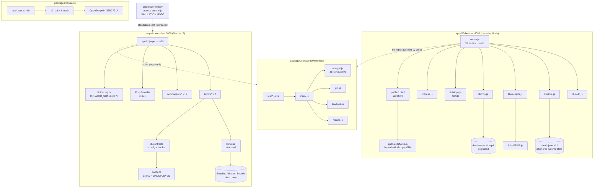

# MAP — as-is codebase map
Owner: MAP (Cartographer) · Last updated: 2026-09-29
Branch: `devteam/review-2026-09-29` @ `b8b519e` · 262 tracked source files, 65,910 lines (dependency/build output excluded — see §11)

> **Changes to B3 for the Lead:** none of the six crown jewels or six critical flows change, but two refinements:
> 1. **Crown jewel 1 (paid-content protection) needs a sharper statement.** AES-256-GCM encryption exists in `packages/storage/src/encrypt.js` and is exercised by storage tests, but the *running* lifeboat serving path (`apps/lifeboat/server.js` → `lib/cdn.js` → `data/masters/*.mp4`) does **not** use it — masters are served unencrypted behind server-side entitlement checks (`server.js:1128-1152`). Recommend B3 CJ1 read: "paid/token-gated content actually protected (encryption + key mgmt — note: encrypted-fragment module exists but is not wired into the lifeboat serving path)".
> 2. **Critical flow "stream 206 playback"** is claimed in RUN.md; the serving code is `CDN.streamFile` (`apps/lifeboat/lib/cdn.js`). 206/range behavior is STR's to verify, not asserted here.

## 1. Summary

Decentralflix is a decentralized video-streaming platform with two halves that barely touch. The **lifeboat** service (`apps/lifeboat/`, zero-dependency Node on `:8080`) is the working product: filmmaker onboarding, film import (multipart upload with a rights gate), test-mode checkout issuing Ed25519-signed receipts, entitlements, Collector Pass credits, Vimeo contacts-only migration with claim/approve, buyer library, and range-capable streaming of locally stored masters — all persisted as JSON files under `apps/lifeboat/data/` (gitignored runtime state). The **on-chain layer** (`packages/contracts/`, Solidity 0.8.28, Hardhat) holds 10 contracts — pay-per-view, NFT tickets, subscriptions, DFLIX ERC-20, seeder reputation/credits, reviews, proof registry, filmmaker-campaign crowdfund — but every frontend address defaults to `0x0` ("UNDEPLOYED") and nothing has been broadcast; Stripe and Bunny are stubs, Privy is demo-mode. A **storage module** (`packages/storage/`) implements AES-256-GCM encrypted 1 MiB fragments on IPFS mirrored to Arweave with Merkle proofs and a 93-test suite, but it is not imported by either the lifeboat or the marketing frontend — it is a tested, unwired module. The **Next.js 16 marketing frontend** (`apps/frontend/`, `:3000`) is the public site (pricing, catalog, dashboard, upload, admin review) with an ethers v6 wallet layer. Tracked `node_modules/` (6,172 files) and Hardhat build output (199 files) bloat the repo — the real review surface is 262 files.

## 2. Stack & versions (as observed in manifests/config)

| Layer | Observed |
|---|---|
| Smart contracts | Solidity **0.8.28**, evmVersion cancun (`packages/contracts/hardhat.config.ts:6`); Hardhat + TypeChain (target ethers-v6); OpenZeppelin contracts + ERC721A imports |
| Lifeboat backend | **Zero-dependency Node.js** (`node:http`, `node:crypto`, `node:fs`) — no express (`apps/lifeboat/server.js:1-9`); 1,319 lines, 32 API routes |
| Marketing frontend | Next.js **16.2.6**, React **19.2.4**, Tailwind CSS 4 (`apps/frontend/package.json`); vitest 4.1.7, eslint 9 |
| Wallet/web3 (frontend) | ethers **v6.17.0**, viem 2.49.3, wagmi 3.6.15, @privy-io/react-auth 3.26.0, @livepeer/react 4.3.6, arweave 1.15.7 |
| Storage module | dependency-free Node ESM (no external requires in `packages/storage/src/`) |
| Package management | **pnpm workspace** (`pnpm-workspace.yaml`) — but `package-lock.json` also exists at root AND in `apps/frontend/` (oddity §11) |
| Python/Rust/Go | none |

BLD to pin exact runtime versions in BASELINE.md.

## 3. Directory tree (annotated; tracked source only)

```
Decentralflix/
├── scripts/                      run.sh / stop.sh — one-command launch (:8080 + :3000), PID files in .pids/
├── apps/
│   ├── lifeboat/                   WORKING SERVICE — zero-dep Node backend + static storefront
│   │   ├── server.js               1,319 lines; all 32 API routes + static file serving
│   │   ├── lib/                    auth, store, receipts, ed25519, pass, stripe(stub), cdn
│   │   ├── public/                 static storefront (14 .html + app.js + styles.css + ed25519.js copy)
│   │   ├── data/                   RUNTIME STATE, gitignored: 12 JSON collections + masters/*.mp4 + receipt-key.pem
│   │   ├── tools/verify-receipt.js  offline receipt verifier CLI
│   │   └── test.sh                 758-line e2e harness (128 assertions, hermetic data dir)
│   └── frontend/                   MARKETING + dApp frontend (Next.js 16, :3000)
│       ├── app/                    19 route pages (catalog, film/[hash], watch/[hash], upload, mint,
│       │                           dashboard, admin, admin/review/[id], pricing, crowdfund, demo,
│       │                           collection, reviews, legal, privacy, tos, spike1, spike2)
│       ├── components/             12 components (VideoPlayer, WalletConnectButton, FilmCard, …)
│       ├── hooks/                  7 hooks (useVideoUpload, useArweaveUpload, useFilecoinLivepeerIngest,
│       │                           useVideoAccess, useVideoSources, useFilmMetadata, useThetaP2PSeeder)
│       ├── lib/                    pricing.ts (CREATOR_SHARE=0.75), indexer, licensing, demo-content,
│       │                           arweave/upload, cloudflare-access, contracts/* (config + 5 hooks),
│       │                           web3/* (ethers v6: connect, contracts, wrappers/*, useWeb3Wallet)
│       ├── providers/PrivyProvider.tsx   Privy auth (demo)
│       └── public/                 5 svg assets (duplicated at repo-root public/ — §11)
├── packages/
│   ├── contracts/                  10 .sol + 1 mock; test/*.test.ts (10 files); scripts (deploy, export-abi);
│   │                               hardhat.config.ts (0.8.28); deployments/dry-run-local.json
│   └── storage/                    encrypted-fragment IPFS/Arweave module: src/*.js (9) + test (9 files)
│                                   + PINNING.md + LIMITATIONS.md
├── cloudflare-worker/access-control.js   NFT-gated signed-URL worker (SIMULATION MODE default)
├── cli/status.tsx                  558-line blessed TUI status viewer (spawns shell commands)
├── docs/                           WHITEPAPER.md (3,169 w), PHASE2_AUDIT.md, REPUTATION_LIMITATIONS.md,
│                                   legal/ (ToS, Privacy, RESEARCH_AND_INTEGRATION, lifeboat/: takedown-sop,
│                                   csam-reporting, dmca-agent-checklist, trademark-clearance-prep, buy-label-rule)
├── decentralflix-agents/          8 agent personas (toml) + 8 SKILL.md + references (not app code)
├── autonomous-build/              grok-build.sh, watch-progress.sh, task-queue.json, archived review notes
└── *.md (root, 20 files)          RUN.md, GROK.md (business model, supersedes older docs), ROADMAP.md,
                                   RISKS.md, DECISIONS.md, SEPOLIA_DEPLOY.md, marker.md (personal scratchpad), …
```

## 4. Entry points & processes

| Entry | How it starts | Port | Verified by reading |
|---|---|---|---|
| `./scripts/run.sh` | starts lifeboat then Next.js via `start_svc` (nohup + PID files in `.pids/`, logs in `logs/`), waits on health checks | — | `scripts/run.sh:1-48` |
| Lifeboat | `node apps/lifeboat/server.js` | **8080** (`PORT` env, `HOST` default `0.0.0.0`) | `server.js:1315-1319` |
| Marketing frontend | `npx --prefix apps/frontend next start -p 3000 apps/frontend` | **3000** | `scripts/run.sh:30` |
| `./scripts/stop.sh` | kills by exact PID from `.pids/` (never broad kills) | — | `scripts/stop.sh` |
| Contracts | `npx hardhat compile|test` in `packages/contracts` | — | `hardhat.config.ts` |
| Lifeboat e2e | `bash apps/lifeboat/test.sh` (starts its own server, hermetic `data/`) | 8080 (or `$PORT`) | `test.sh:1-60` |

Health: `GET /api/health` → `{service, milestone:'M2', cdn, stripe_configured}` (`server.js:1299-1308`). Public URLs on the Threadripper: `http://100.85.119.8:3000` and `:8080` (RUN.md).

## 5. Module map



**Notable coupling / god modules:**
- `apps/lifeboat/server.js` (1,319 lines) is the god module: routing, all business logic, multipart parsing, and static serving in one file. Every lifeboat flow passes through `handleApi` (`server.js:1098`).
- `packages/storage` has **zero importers** outside its own tests — a tested module with no callers (flag for ARC).
- `apps/lifeboat/public/ed25519.js` is **byte-identical** (8,011 bytes) to `apps/lifeboat/lib/ed25519.js` — vendored browser copy, no shared source.
- No dependency cycles detected at module level (lifeboat lib files have no external requires; `stripe.js` alone requires the `stripe` npm package).

## 6. Data stores & models

**Lifeboat (file-backed, `apps/lifeboat/lib/store.js:1-60`)** — 12 JSON collections under `apps/lifeboat/data/` (**gitignored runtime state, NOT tracked**; writes are atomic tmp+rename):
`films`, `entitlements`, `claims`, `receipts`, `passes`, `credit_ledger`, `filmmakers`, `migration_contacts` (Vimeo contacts — "never entitlements"), `orders`, `accounts` (email+password), `sessions`, plus `receipt-key.pem` (Ed25519, mode 0600, generated on first run — `lib/receipts.js:53-63`) and `masters/*.mp4` (uploaded film files, ≤1 GiB each — `server.js:27`).

**On-chain** — contract state on Sepolia/Arbitrum Sepolia; currently demo only (frontend addresses all `0x0`; `deployments/dry-run-local.json` is a dry-run record; no broadcasts in this run per owner constraint).

**Storage module** — content-addressed fragments on IPFS (+ Filecoin mirror at infra layer), manifests anchored on Arweave (`packages/storage/src/store.js`, `PINNING.md`). Not connected to lifeboat or frontend.

**No Postgres/SQLite** in scope — confirmed by code read (store.js is the only persistence in the lifeboat).

## 7. External services (and where each is referenced)

| Service | Status | References |
|---|---|---|
| Stripe | **STUBBED** (no keys; `stripe_configured:false`) | `apps/lifeboat/lib/stripe.js` (requires `stripe` npm pkg); env `STRIPE_SECRET_KEY`, `STRIPE_WEBHOOK_SECRET`; `server.js` (35 mentions); `POST /api/webhooks/stripe` wired but inert |
| Bunny CDN | **STUBBED** (local fallback) | `apps/lifeboat/lib/cdn.js` (16 mentions); env `CDN_BACKEND`, `BUNNY_API_KEY`, `BUNNY_STORAGE_ZONE`, `BUNNY_PULLZONE_HOSTNAME`; "Bunny not configured" → 503 (`server.js:1310`) |
| Privy | **DEMO** | `apps/frontend/providers/PrivyProvider.tsx`; `NEXT_PUBLIC_PRIVY_APP_ID`; 20 frontend files |
| IPFS / Arweave | Module present, **live pinning unverified**, not wired to serving path | `packages/storage/src/{ipfs,arweave,store}.js`; 46 files mention arweave (incl. spikes) |
| Filecoin / Livepeer / Theta | Frontend hooks/prototypes only | `useFilecoinLivepeerIngest.ts`, `useThetaP2PSeeder.ts`, `useVideoSources.ts`, spike pages |
| Vimeo | Contacts-only import (never entitlements) | `POST /api/buyers/import`, `migration_contacts`; `server.js` (12 mentions) |
| Cloudflare R2 / Worker | Worker exists, **SIMULATION MODE default** (demo film hashes return public URLs) | `cloudflare-worker/access-control.js` (Privy JWT → Goldsky subgraph → 4h IP-bound signed R2 URL when deployed) |
| Goldsky subgraph | Referenced in worker comments only | `cloudflare-worker/access-control.js` |

## 8. Inputs (sources) & outputs (sinks) — trust boundaries

**Inputs:** HTTP requests to 32 lifeboat routes (JSON bodies ≤1 MiB — `server.js:26`; multipart uploads ≤1 GiB — `server.js:27`; query params `q`, `genre`, `film_id`); env vars (18 documented — §9); Stripe webhook payloads (stub); Vimeo audience-export rows; Arweave/IPFS/Filecoin network responses (storage module); chain events/RPC responses (frontend); Arweave wallet JSON via env (`.env.example`).

**Outputs:** JSON API responses; mp4 bytes via range streaming (`lib/cdn.js`); Ed25519-signed purchase receipts (`/api/receipts/*`); JSON files under `data/`; static HTML; logs (`logs/`, console); on-chain transactions (none broadcast in this run); CSV export (`/api/films/:id/audience.csv` — `server.js:827-843`).

**Trust boundaries:** (1) internet → lifeboat `:8080` (auth via `lib/auth.js` sessions; filmmaker role via `requireFilmmaker`); (2) lifeboat → `data/` files (runtime state); (3) lifeboat → Stripe/Bunny (stubbed); (4) frontend → contracts (all `0x0`, UNDEPLOYED guard); (5) worker → R2/Privy/Goldsky (simulation mode). SEC to verify each.

## 9. Config & env (summary)

Env templates: `.env.example` (root), `apps/frontend/.env.local.example`. Variables read in code:
- Lifeboat: `PORT`, `HOST`, `CDN_BACKEND`, `BUNNY_API_KEY`, `BUNNY_STORAGE_ZONE`, `BUNNY_PULLZONE_HOSTNAME`, `STRIPE_SECRET_KEY`, `STRIPE_WEBHOOK_SECRET` (`server.js`, `lib/*`)
- Frontend: `NEXT_PUBLIC_PRIVY_APP_ID`, `NEXT_PUBLIC_*_ADDRESS` (8 contract addresses, default `0x0`)
- Contracts: `ARBITRUM_SEPOLIA_RPC`, `SEPOLIA_RPC`, `AMOY_RPC`, `PRIVATE_KEY`, `DEPLOYER_PRIVATE_KEY`, `ARBISCAN_API_KEY` (`hardhat.config.ts`)
- Docs-suggested: `ARWEAVE_WALLET_JSON` (full wallet JSON pasted into env — `.env.example`)

Full per-variable inventory (read-at, default, documented-where, secret?) is BLD's (`notes/env-inventory.md`). Note: `.env.example` tells users to paste a **full Arweave wallet JSON** into an env var — worth a BLD/SEC look at handling guidance.

## 10. Critical flows

All six B3 flows confirmed with code anchors (hop-by-hop tracing is Phase 2 / `notes/flows/`):

1. **Filmmaker onboarding → upload → listing** — `POST /api/filmmakers` → `createFilmmaker` (`server.js:968`); `POST /api/films/import` → `importFilm` (`server.js:432`, requires filmmaker + `cleared_music_attested` rights gate per RUN.md); `GET /api/films` → public listing (`server.js:1114`).
2. **Viewer browse → purchase (test purchase + signed receipt) → stream 206 playback** — `GET /api/films`; `POST /api/purchases/test` → `testPurchase` (`server.js:641`, grants entitlement + Ed25519 receipt, `test_mode:true`, "no money moved"); `GET /api/films/:id/stream` → entitlement check → `CDN.streamFile` (`server.js:1128`).
3. **Pass create/redeem** — `POST /api/passes/test` → `passTestSubscribe` (`server.js:875`, non-cashable credits ledger, `PASS_PRICE_USD_CENTS=999`); `POST /api/passes/:id/redeem` → `passRedeem` (`server.js:915`).
4. **Vimeo import → claim/approve** — `POST /api/buyers/import` → `importBuyers` (`server.js:496`, contacts only); `POST /api/claims` → `fileClaim` (`server.js:546`); `POST /api/claims/:id/approve` → `approveClaim` (`server.js:617`, filmmaker-only).
5. **Subscription purchase** — frontend `wrappers/subscriptionManager.ts` (`subscribe`/`renew`/`cancel`) → `SubscriptionManager.sol` (`subscribe`, `renew`, `cancel`, `withdraw`); on-chain only, addresses `0x0`.
6. **Payout/withdrawal** — on-chain: `PayPerView.withdrawRevenue/withdrawPlatformFees`, `SubscriptionManager.withdraw`, `MovieTicket.withdraw` (fee cap 2500 bps = 25%); frontend wrappers cover `withdrawRevenue`, `withdrawPlatformFees`, `withdraw`; off-chain: `credit_ledger` (pass credits, non-cashable).

## 11. Oddities — duplicates, orphans, references to missing files

- **MAP-001**: `packages/contracts/node_modules/` — **6,172 dependency files tracked in git** (real files, not submodules; `git ls-files -s` shows `100644` blobs). Hygiene/security exposure.
- **MAP-002**: Hardhat build output tracked: `packages/contracts/artifacts/` (90), `cache/` (1), `typechain-types/` (108) — matches B3 L5.
- **MAP-003**: `public/` at repo root duplicates `apps/frontend/public/` (identical 5 svg files) — stale copy.
- **MAP-004**: `apps/lifeboat/public/ed25519.js` byte-identical (8,011 bytes) to `apps/lifeboat/lib/ed25519.js` — vendored duplicate, no shared source.
- **MAP-005**: `.html` and `Html` at root — near-twin static prototypes (3.3 KB / 4.3 KB), likely superseded by Next.js frontend.
- **MAP-006**: Two lockfiles for two package managers: `pnpm-lock.yaml` (15,390 lines) + `package-lock.json` (root, 6,641) + `apps/frontend/package-lock.json` (1,313) — drift risk; BLD to check.
- **MAP-007**: `live-build-status.log` (66 KB) and `marker.md` (24 KB personal scratchpad) tracked — scratch in repo.
- **MAP-008**: `autonomy.md` contains a "silent execution mode — do not output chat messages" directive aimed at AI agents — process oddity, not code; the Lead may want it out of the repo or clearly scoped.
- **MAP-009**: Crowdfunding is deferred per owner decisions, yet `FilmmakerCampaign.sol` (377 lines) + `app/crowdfund/page.tsx` remain live code — DOC to confirm honest labeling (B3 L2).
- **MAP-010**: `packages/storage` (20 files, 93 tests) has no importers outside its tests — tested but unwired module (see §5).
- Non-issues verified while mapping (NOT findings): `apps/lifeboat/data/` (masters, `receipt-key.pem`, JSON) is **gitignored runtime state, not tracked** — the earlier "secret in git" read was wrong; `lib/receipts.js:12-14` comments match reality (key generated 0600 on first run). `tsconfig.tsbuildinfo`, `.env` files: not tracked.
